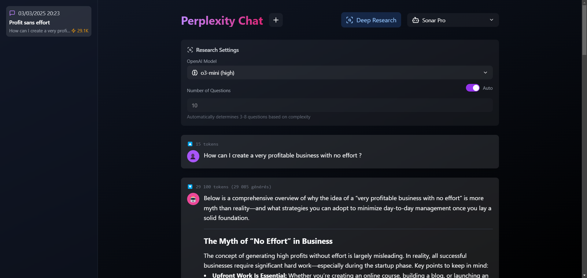
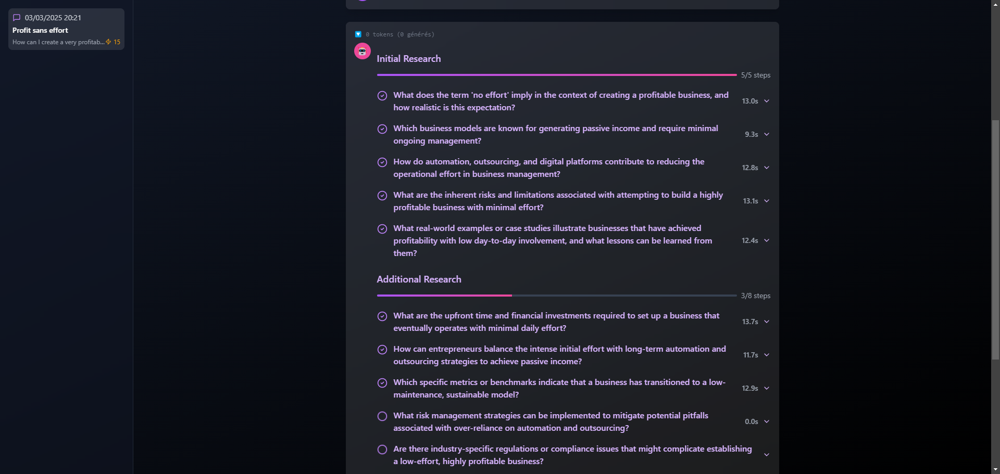

# Perplexity Fast Chat 🚀

<div align="center">


**A modern web interface to interact with Perplexity AI and OpenAI models, featuring a unique deep research mode.**

[Features](#features-) • [Preview](#preview-) • [Installation](#installation-%EF%B8%8F) • [Usage](#usage-) • [Technologies](#technologies-used-) • [Project Structure](#project-structure-) • [Contribution](#contribution-)

</div>

## Table of Contents 📑

- [Features](#features-)
- [Preview](#preview-)
- [Installation](#installation-%EF%B8%8F)
- [Usage](#usage-)
- [Technologies Used](#technologies-used-)
- [Project Structure](#project-structure-)
- [Deep Research Mode](#deep-research-mode-)
- [Research Settings](#research-settings-%EF%B8%8F)
- [Contribution](#contribution-)
- [License](#license-)

## Features ✨

### Models Support
- 🤖 **Perplexity AI Models**
  - Sonar Reasoning Pro
  - Sonar Reasoning
  - Sonar Pro
  - Sonar
  - R1-1776
- 🧠 **OpenAI Models for Deep Research**
  - o3-mini (high reasoning)
  - o1-mini
  - o1-preview
  - o1
  - 4o

### Core Features
- 🔍 **Exclusive Deep Research Mode**
  - Automatic breakdown of complex questions
  - Multi-step in-depth research
  - Final synthesis of results
  - Configurable question count (auto or manual)
  - Multiple research phases
- 💬 **Modern Chat Interface**
  - Conversation history
  - Markdown support
  - Citations and references
  - "Thinking" mode with animations
- 🎨 **Sleek Design**
  - Responsive interface
  - Dark mode
  - Smooth animations
  - Support for links and references

## Preview 📸

<div align="center">

### Deep Research Mode


### Chat Interface


</div>

## Installation 🛠️

### Prerequisites
- Node.js (v16+)
- pnpm (v6+)
- Perplexity API key
- OpenAI API key

### Setup Steps

1. **Clone the repository**
   ```bash
   git clone https://github.com/your-username/perplexity-fast-chat.git
   cd perplexity-fast-chat
   ```

2. **Install dependencies**
   ```bash
   pnpm install
   ```

3. **Configure environment variables**
   
   Create a `.env` file at the project root:
   ```env
   PERPLEXITY_API_KEY=your_perplexity_api_key
   OPENAI_API_KEY=your_openai_api_key
   ```

4. **Start the development server**
   ```bash
   pnpm dev
   ```
   
   Your app should now be running at [http://localhost:5173](http://localhost:5173)

## Usage 🔮

1. **Select a model** from the dropdown menu
2. **Choose a mode**:
   - Regular chat for quick answers
   - Deep Research for complex questions
3. **Type your question** or prompt
4. For Deep Research mode, configure:
   - OpenAI model for analysis
   - Question count (auto or manual)

## Technologies Used 🧰

<div align="center">

[](https://kit.svelte.dev/)
[](https://tailwindcss.com/)
[](https://www.typescriptlang.org/)

</div>

- **[SvelteKit](https://kit.svelte.dev/)** - Web framework
- **[TailwindCSS](https://tailwindcss.com/)** - CSS framework
- **[Perplexity AI API](https://docs.perplexity.ai/)** - Chat API
- **[OpenAI API](https://platform.openai.com/)** - API for Deep Research mode
- **[Marked](https://marked.js.org/)** - Markdown parsing
- **[Lucide Icons](https://lucide.dev/)** - Icon set

## Project Structure 📁

```
/
├── src/
│   ├── routes/             # Application routes
│   │   ├── +page.svelte    # Main page
│   │   └── api/            # API endpoints
│   │       ├── chat/       # Standard chat endpoint
│   │       ├── deep-research/ # Deep Research endpoint
│   │       └── name/       # Name generation endpoint
│   └── lib/                # Components and utilities
│       ├── components/     # Svelte components
│       │   └── common/     # Common small components
│       ├── helpers/        # Helper functions
│       ├── stores/         # Svelte stores
│       └── types/          # TypeScript types
├── images/                 # Screenshots and images
├── .env                    # Environment variables
└── package.json           # Dependencies and scripts
```

## Deep Research Mode 🔬


The Deep Research mode is a unique feature that:

1. **Analyzes** your question using OpenAI models (configurable)
2. **Breaks down** into relevant sub-questions (auto or manual count)
3. **Researches** each aspect using Perplexity AI
4. **Organizes** research into multiple phases when needed
5. **Synthesizes** the results into a comprehensive answer
6. **Provides** detailed timing and progress information

<br clear="right"/>

## Research Settings ⚙️

The Deep Research mode includes configurable settings:

| Setting | Options | Description |
|---------|---------|-------------|
| OpenAI Model | o3-mini, o1-mini, o1-preview, o1, 4o | Select model for question analysis |
| Question Count | Auto / Manual (3-40) | Control how many sub-questions are generated |
| Reasoning | High / Standard | Different reasoning approaches based on model |

## Contribution 🤝

Contributions are welcome! Please follow these steps:

1. **Fork** the project
2. **Create** a branch (`git checkout -b feature/improvement`)
3. **Commit** your changes (`git commit -m 'Add feature'`)
4. **Push** to the branch (`git push origin feature/improvement`)
5. **Open** a Pull Request

Please ensure your code follows the project's coding style and include appropriate tests.

## License 📄

This project is licensed under the MIT License - see the [LICENSE](LICENSE) file for details.

---

<div align="center">
Made with ❤️ for AI research enthusiasts
</div>
